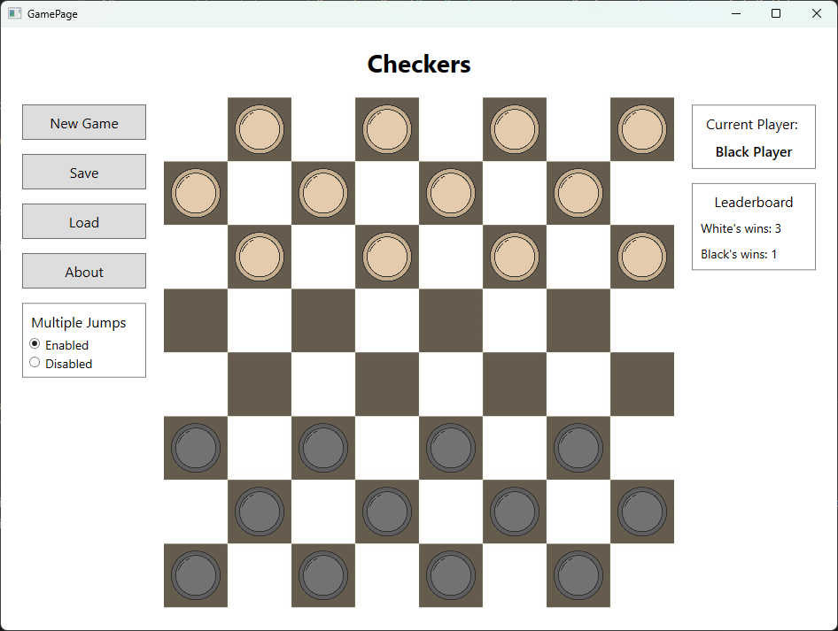
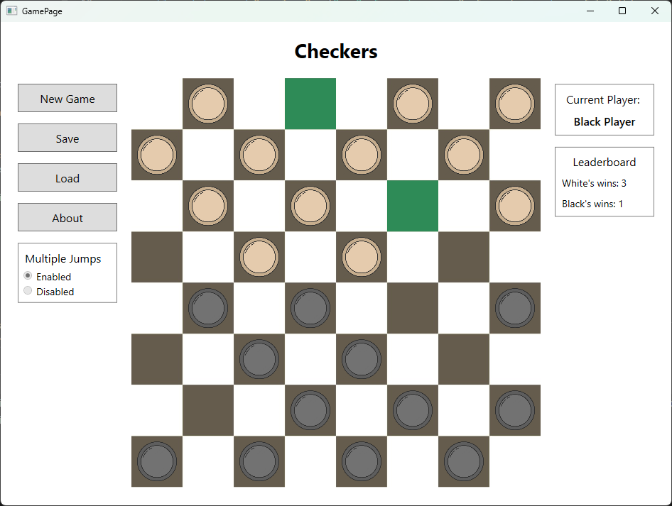

# Checkers Game (MVVM)

## Overview

The Checkers Game is a C# desktop application developed using WPF (Windows Presentation Foundation) and follows the MVVM (Model-View-ViewModel) design pattern. It provides a classic checkers experience with interactive gameplay and visual indicators for player turns and remaining pieces on the board.

## Features

- **Two Player Mode**: Players take turns moving their pieces on an 8x8 board.
- **Piece Transformations**: Pieces reaching the opponent's end of the board are transformed into "kings," allowing diagonal movement in both directions.
- **Capture Mechanism**: Players can capture their opponent's pieces by jumping over them. Multiple captures in a single turn are possible if additional captures are available.
- **Optional Multiple Jumps**: Players can enable or disable the option for multiple jumps at the start of the game.
- **Game State Saving**: Allows players to save and load game states, including the current player's turn.
- **End of Game Detection**: The game ends when one player has no more pieces remaining on the board. The winning player is displayed, and the game statistics are updated.

## Gameplay

- Players with red pieces start the game, followed by alternating turns.
- Regular moves involve moving a piece diagonally forward by one square.
- Kings can move diagonally in both forward and backward directions.
- Captures involve jumping over an opponent's piece to capture it. Multiple captures are allowed if available.
- The game continues until one player captures all of their opponent's pieces or a draw is declared.

## User Interface

- The main interface displays the game board and indicates which player's turn it is.
- Game menus include options for starting a new game, saving the current game state, loading a saved game, toggling multiple jumps, and viewing game statistics.
- The Help menu provides information about the creator of the program and a brief description of the game.

## Development Details

- **Technologies Used**: C#, WPF (Windows Presentation Foundation), MVVM Design Pattern
- **Data Persistence**: Game states are saved and loaded from files using a chosen encoding format (binary, text, JSON, XML, etc.).
- **User Interaction**: Utilizes event-driven programming to handle player moves and game state changes.
- **Game Logic**: Implements rules for piece movements, captures, king transformations, and end-of-game conditions.

## Setup and Usage

To run the Checkers Game application:

1. Clone the repository or download the application source code.
2. Open the project in Visual Studio or any compatible IDE.
3. Build the solution to resolve dependencies.
4. Run the application from the IDE or by executing the compiled executable.

## Contributions

Contributions to the project are welcome! If you encounter any issues or have suggestions for improvements, feel free to submit a pull request or open an issue on the GitHub repository.

## License

This project is not licensed and comes with no warranty or guarantee of any kind. You are free to view and fork the code for personal and educational purposes.

Enjoy playing Checkers! 🏁
